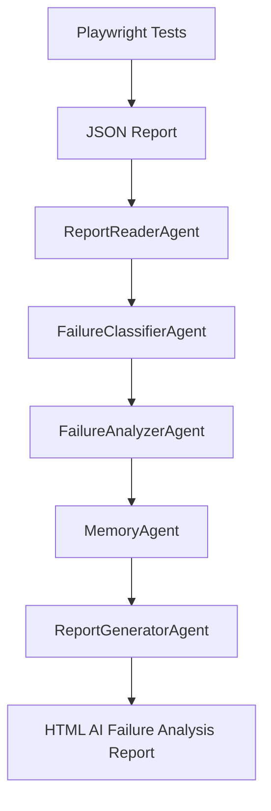
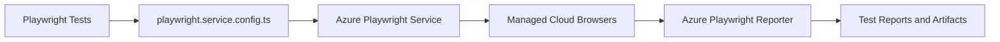
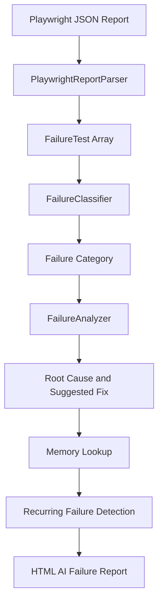
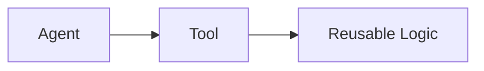
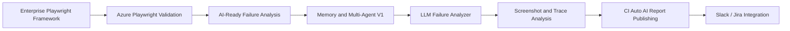

# 🚀 Enterprise Playwright Framework


An enterprise-grade **Playwright TypeScript automation framework** built for UI testing, API testing, reporting, Azure Playwright validation, and AI-ready failure analysis.

This project demonstrates how a traditional test automation framework can evolve into an intelligent QA engineering platform with failure classification, root-cause analysis, recurring failure memory, custom HTML reporting, and multi-agent style orchestration.

> **Note:** The current AI layer is rule-based and AI-ready. LLM-based reasoning is planned as the next enhancement.

---

## 📌 Project Highlights

```text
✅ Playwright TypeScript Automation
✅ UI Automation
✅ API Automation
✅ Page Object Model
✅ Custom Fixtures
✅ Environment Configuration
✅ JSON Reporting
✅ Playwright HTML Reporting
✅ Azure Playwright Service Configuration
✅ Azure Playwright Reporter Setup
✅ GitHub Actions Pipeline
✅ AI-Ready Failure Analysis
✅ Tool-Based Architecture
✅ Memory-Based Recurring Failure Detection
✅ Multi-Agent Style Orchestration
✅ Custom HTML AI Failure Report
```

---

## 🧠 High-Level Architecture



---

## 🧰 Tech Stack

| Area             | Tools / Technologies                                          |
| ---------------- | ------------------------------------------------------------- |
| Automation       | Playwright                                                    |
| Language         | TypeScript                                                    |
| Runtime          | Node.js                                                       |
| Test Types       | UI Testing, API Testing                                       |
| Design Pattern   | Page Object Model                                             |
| Execution        | Local, GitHub Actions, Azure Playwright Service Config        |
| Reporting        | Playwright HTML Report, JSON Report, Custom AI Failure Report |
| Cloud Validation | Azure Playwright Service / Playwright Workspaces              |
| Authentication   | Azure Identity                                                |
| AI-Ready Layer   | Rule-based Analyzer, Tools, Memory, Agents                    |

---

## 📂 Project Structure

```text
enterprise-playwright-framework
│
├── ai
│   ├── agents
│   ├── analyzer
│   ├── classifier
│   ├── contracts
│   ├── knowledge-base
│   ├── memory
│   ├── models
│   ├── orchestrators
│   ├── parser
│   ├── reporter
│   ├── runner
│   └── tools
│
├── config
├── fixtures
├── pages
├── reports
│   ├── ai-analysis
│   └── json
│
├── tests
│   ├── api
│   └── ui
│
├── utils
├── playwright-report
├── test-results
├── playwright.config.ts
├── playwright.service.config.ts
├── package.json
└── tsconfig.json
```

---

## 🧪 Core Automation Capabilities

### ✅ UI Automation

The framework supports browser-based UI automation using Playwright with a structured Page Object Model approach.

Key capabilities:

* Page Object Model structure
* Reusable page classes
* UI smoke test coverage
* Locator-based validation
* Fixtures for test setup and teardown
* Environment-specific execution

---

### ✅ API Automation

The framework includes API testing support using Playwright request capabilities.

Key capabilities:

* API request validation
* Status code verification
* Response body validation
* API test organization
* API and UI test separation

---

### ✅ Fixtures

Custom fixtures are used to improve test reusability and maintain cleaner test files.

Fixtures help with:

* Browser context setup
* Page setup
* API context setup
* Reusable test dependencies
* Cleaner test execution flow

---

## ☁️ Azure Playwright Service Integration

This framework includes configuration support for running Playwright tests with **Azure Playwright Service / Playwright Workspaces**.

The Azure service configuration is maintained separately from the default local Playwright configuration so that tests can be executed locally or through Azure-managed cloud browsers when required.

### Azure Configuration File

```text
playwright.service.config.ts
```

This configuration includes:

```text
✅ Azure Playwright configuration
✅ Azure Playwright reporter setup
✅ Azure Identity support
✅ Cloud browser execution configuration
✅ HTML reporter support
✅ Linux-based cloud execution configuration
```

---

### Azure Playwright Flow



---

### Purpose of Azure Setup

The Azure Playwright setup is useful for:

* Running tests on managed cloud browsers
* Scaling browser execution beyond the local machine
* Validating Playwright tests in a cloud-supported execution environment
* Publishing test results using Azure Playwright reporting
* Preparing the framework for enterprise CI/CD execution

---

### Azure Playwright Execution

```bash
npx playwright test --config=playwright.service.config.ts
```

---

## 📊 Reporting

This framework supports multiple reporting layers.

| Report Type               | Purpose                                         |
| ------------------------- | ----------------------------------------------- |
| Playwright HTML Report    | Standard Playwright test execution report       |
| JSON Report               | Machine-readable report for automation analysis |
| Azure Playwright Reporter | Azure-supported cloud execution reporting       |
| Custom AI Failure Report  | Human-readable root-cause failure analysis      |

---

## 🧠 AI-Ready Failure Analysis

The framework includes a custom AI-ready failure analysis pipeline.

It reads Playwright JSON reports, extracts failed tests, classifies failures, analyzes likely root causes, checks historical memory, and generates a custom HTML failure analysis report.

---

## 🔁 AI Failure Analysis Flow



---

## 🤖 Multi-Agent Style Architecture

The framework uses a multi-agent style design where each agent owns a specific responsibility.

```text
AIFailureReportOrchestrator
        ↓
ReportReaderAgent
        ↓
FailureClassifierAgent
        ↓
FailureAnalyzerAgent
        ↓
MemoryAgent
        ↓
ReportGeneratorAgent
```

---

## 🧩 Agents

| Agent                  | Responsibility                                  |
| ---------------------- | ----------------------------------------------- |
| ReportReaderAgent      | Reads Playwright JSON execution report          |
| FailureClassifierAgent | Classifies failed tests into failure categories |
| FailureAnalyzerAgent   | Performs rule-based root-cause analysis         |
| MemoryAgent            | Checks and updates recurring failure memory     |
| ReportGeneratorAgent   | Generates custom HTML AI failure report         |

---

## 🛠️ Tool-Based Architecture

Each agent internally uses a tool to perform its work.



Current tools:

```text
AgentTool.ts
PlaywrightReportReaderTool.ts
FailureClassificationTool.ts
FailureAnalysisTool.ts
HtmlFailureReportGeneratorTool.ts
```

This keeps the framework modular, testable, and extensible.

---

## 🧠 Failure Classification

The framework classifies failures into meaningful categories such as:

```text
ASSERTION_FAILURE
LOCATOR_FAILURE
TIMEOUT_FAILURE
API_FAILURE
UNKNOWN_FAILURE
```

Example:

```text
Error: expect(received).toBe(expected)
↓
Category: ASSERTION_FAILURE
```

---

## 🔍 Failure Analysis

The failure analyzer uses:

```text
✅ Error message
✅ Stack trace
✅ Failure category
✅ Known failure patterns
✅ Context-aware matching rules
```

It generates:

```text
✅ Root cause
✅ Confidence score
✅ Suggested fixes
```

---

## 📚 Knowledge Base

Known failure patterns are stored separately in a JSON knowledge base.

```text
ai/knowledge-base/failure-patterns.json
```

This makes failure analysis configurable and easier to extend.

---

## 🧠 Memory-Based Recurring Failure Detection

The framework includes Memory V1 to track repeated failures.

Memory stores:

```text
✅ Test name
✅ Failure category
✅ Error signature
✅ Root cause
✅ Suggested fixes
✅ Occurrence count
✅ First seen date
✅ Last seen date
```

Memory file:

```text
ai/memory/failure-memory.json
```

---

## 📄 Custom HTML AI Failure Report

The framework generates a custom HTML report for failure analysis.

Output path:

```text
reports/ai-analysis/ai-failure-analysis-report.html
```

The report includes:

```text
✅ Total failures
✅ Failure category summary
✅ Failed test details
✅ Root cause
✅ Confidence score
✅ Suggested fixes
✅ Recurring failure status
✅ Previous occurrence count
✅ First seen date
✅ Last seen date
✅ Error message
```

---

## 📌 Example AI Failure Report Output

```text
Test: TC10 - Verify My Action Widget Visibility

Category:
LOCATOR_FAILURE

Root Cause:
Page navigation did not complete before the test attempted validation or interaction.

Confidence:
85%

Recurring Failure:
Yes

Previous Occurrences:
3

Suggested Fixes:
- Wait for page navigation to complete before interacting with elements
- Use page.waitForURL() for expected route changes
- Avoid asserting dashboard elements immediately after login submit
```

---

## ▶️ Commands

### Install Dependencies

```bash
npm install
```

---

### Install Playwright Browsers

```bash
npx playwright install
```

---

### Run QA Tests

```bash
npm run test:qa
```

---

### Run DEV Tests

```bash
npm run test:dev
```

---

### Run Tests Using Azure Playwright Service Config

```bash
npx playwright test --config=playwright.service.config.ts
```

---

### Generate AI Failure Analysis Report

```bash
npm run ai:failure-report -- "reports/json/EPF_Report_2026-06-15_17-04-23.json"
```

Generated report:

```text
reports/ai-analysis/ai-failure-analysis-report.html
```

---

## 🔄 GitHub Actions

The framework includes GitHub Actions support for Playwright execution.

CI pipeline capabilities:

```text
✅ Install dependencies
✅ Install Playwright browsers
✅ Run Playwright tests
✅ Upload Playwright HTML report
✅ Upload test results
```

Planned CI enhancement:

```text
⬜ Run tests using playwright.service.config.ts
⬜ Generate AI failure report automatically after test execution
⬜ Upload AI failure report as CI artifact
```

---

## ✅ Current Completion Status

| Module                          | Status     |
| ------------------------------- | ---------- |
| Playwright TypeScript Framework | ✅ Complete |
| UI Automation                   | ✅ Complete |
| API Automation                  | ✅ Complete |
| Page Object Model               | ✅ Complete |
| Custom Fixtures                 | ✅ Complete |
| Environment Configuration       | ✅ Complete |
| Playwright HTML Report          | ✅ Complete |
| JSON Report                     | ✅ Complete |
| Azure Playwright Service Config | ✅ Complete |
| Azure Playwright Reporter Setup | ✅ Complete |
| GitHub Actions Pipeline         | ✅ Complete |
| Report Parser                   | ✅ Complete |
| Failure Classifier              | ✅ Complete |
| Rule-Based Failure Analyzer     | ✅ Complete |
| Context-Aware Pattern Matching  | ✅ Complete |
| Knowledge Base                  | ✅ Complete |
| HTML AI Failure Report          | ✅ Complete |
| Tool-Based Architecture         | ✅ Complete |
| Memory V1                       | ✅ Complete |
| Multi-Agent V1 Structure        | ✅ Complete |
| LLM-Based Analyzer              | ⏳ Planned  |
| Screenshot / Trace Analysis     | ⏳ Planned  |
| CI Auto AI Report Generation    | ⏳ Planned  |
| Slack / Jira Publishing         | ⏳ Planned  |

---

## 🧭 Roadmap



---

## 🚀 Planned LLM Enhancement

The next phase is to replace or enhance the current rule-based analyzer with an LLM-based analyzer.

Planned flow:

```text
RuleBasedFailureAnalyzerAgent
        ↓
LLMFailureAnalyzerAgent
        ↓
LLM-enhanced root cause analysis
```

The LLM analyzer will reason over:

```text
✅ Error message
✅ Stack trace
✅ Failure category
✅ Known failure patterns
✅ Historical memory
✅ Suggested fixes
✅ Screenshots and traces in future
```

---

## 🎯 Design Principles

This framework follows:

```text
✅ Separation of Concerns
✅ Page Object Model
✅ DRY Principle
✅ Reusable Fixtures
✅ Environment-Based Configuration
✅ Modular AI-Ready Components
✅ Tool-Based Execution
✅ Agent-Style Orchestration
✅ Memory-Based Failure Learning
✅ Clean Reporting for Stakeholders
```

---

## 🏁 Summary

This project demonstrates how a Playwright TypeScript automation framework can be extended beyond simple test execution.

It supports:

```text
🧪 Test Execution
📊 Reporting
☁️ Azure Playwright Validation
🧠 Failure Classification
🔍 Root-Cause Analysis
♻️ Recurring Failure Memory
🤖 Multi-Agent Style Orchestration
📄 Stakeholder-Friendly HTML Failure Reports
```

The current implementation is an **AI-ready QA automation architecture** with rule-based analysis, memory, tools, and multi-agent style orchestration.

The next planned step is **LLM orchestration** to make the failure analyzer capable of true LLM-based reasoning.
